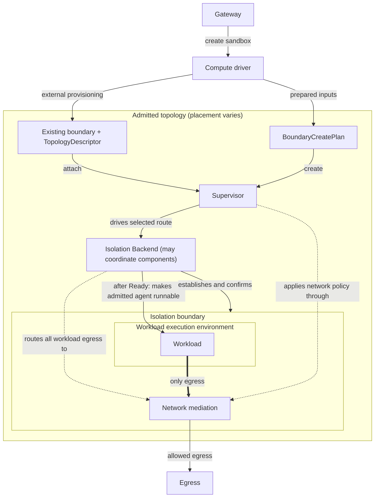

---
authors:
  - "@jganoff"
state: review
links:
  - https://github.com/NVIDIA/OpenShell/issues/1737
  - https://github.com/NVIDIA/OpenShell/pull/2048
  - https://github.com/NVIDIA/OpenShell/issues/899
  - https://github.com/NVIDIA/OpenShell/issues/981
  - https://github.com/NVIDIA/OpenShell/issues/1511
  - https://github.com/NVIDIA/OpenShell/issues/1650
  - https://github.com/NVIDIA/OpenShell/issues/1680
  - https://github.com/NVIDIA/OpenShell/pull/2606
---

# RFC 0012 - Isolation Backend Interface

## Summary

Today the supervisor both builds the workload's isolation boundary and applies its network policy. Because the supervisor runs inside the agent container, the privilege needed to build that boundary sits beside the code it confines. This RFC moves boundary construction and process operations behind a pluggable **Isolation Backend**. The supervisor continues to apply approved network policy through network mediation.

The logical supervisor is the trusted bridge between the gateway and the workload: it maintains the gateway connection, handles authorized requests, and drives the backend. A topology may let its compute driver or external orchestrator provision the boundary and have the supervisor attach, or it may supply a create-capable backend and let the supervisor create the boundary itself. The backend establishes the isolation controls, manages workload processes, and routes egress to network mediation. Both provisioning routes converge on the same lifecycle without topology-specific supervisor paths.

## Motivation

Boundary construction is embedded in the supervisor, so moving it anywhere else means changing the supervisor. That placement creates three problems:

- A compromise reaches the boundary-building privilege in the same container.
- Building the boundary inside the agent container requires capabilities that conflict with restricted deployments. Delegating construction removes that requirement but does not guarantee Pod Security Standards compliance. See [codebase-grounding.md](./codebase-grounding.md) and #899 for background.
- Each new placement adds another branch to the supervisor.

All three come from coupling boundary construction to boundary operation. A common interface lets deployments move privilege without changing the supervisor.

## Non-goals

- **Standardizing a topology's resource API.** Docker, Kubernetes, VM, and other creation mechanisms remain backend-specific.
- **Changing authorization.** [RFC 0001](../0001-core-architecture/README.md) owns control-plane and sandbox identity. A delegated backend must still authenticate callers and scope them to one boundary.
- **Standardizing backend-internal component coordination.** A backend may coordinate helper, sidecar, or interception processes behind one lifecycle; how those components cooperate is backend-specific, not contract surface.
- **Changing gateway lifecycle or public status.** This RFC adds no gateway activation operation, public phase, or status API, and it does not define how a boundary's effective isolation model is surfaced to operators.

## Proposal

The mental model has three roles:

- The **compute driver** prepares placement and creation inputs. Depending on the topology, it either provisions the sandbox instance itself or supplies a create-capable backend to the host supervisor. That placement is the **topology**.
- The **Isolation Backend** establishes and operates the topology-specific controls around the workload. It also routes workload egress to network mediation and provides process operations.
- The **logical supervisor** is the trusted control-plane bridge between the gateway and the workload. It drives the backend, handles authorized gateway requests, and applies approved network policy through network mediation.

Together, network policy, filesystem isolation, syscall filtering, and sandbox identity form the workload's isolation boundary. The roles above enforce that boundary and may run in one process or across several trusted components. Their placement does not change the contract.

Each active boundary has at most one logical supervisor, which may span multiple coupled processes. The backend routes all workload egress through a per-boundary source, and the supervisor consumes that source. Internal delegation and transport remain topology-private.

[RFC 0001](../0001-core-architecture/README.md) continues to own sandbox authentication and authorization. In this contract, sandbox identity means binding the authenticated sandbox context to the isolation boundary.

Admission selects the sandbox's topology, provisioning route, and trusted context. An externally provisioned topology gives the logical supervisor a `TopologyDescriptor` describing the concrete resource to attach. A supervisor-provisioned topology gives it a `BoundaryCreatePlan` for the matching backend. The backend prepares the required controls before the agent starts.



In the in-pod topology, the supervisor drives a backend implemented in the same process. Other topologies may delegate backend operations without changing the supervisor lifecycle.

A boundary is active from successful `create` or `attach` until normal backend cleanup releases the binding or the topology's trusted cleanup path invalidates it. A backend may coordinate multiple trusted helper or interception processes for that boundary. The backend always owns the active-boundary binding. Resource lifecycle ownership follows creation: the backend owns a supervisor-created resource, while the compute driver or external orchestrator owns an externally created resource. Durable trusted state records that origin separately from the opaque descriptor.

### Contract invariants

Six invariants hold for every boundary:

1. Workload egress is denied except through network mediation for the boundary's lifetime.
2. No untrusted instruction executes until every admitted control applicable to that process is in force.
3. An operation is authorized only when the complete effective policy permits it; network operations are decided through network mediation. There is no silent weakening.
4. Agent startup, `exec`, and forwarding occur only through the active backend, and every workload process remains in the admitted execution environment created by the selected lifecycle owner.
5. Shared infrastructure preserves strict per-boundary lifecycle, policy, identity, enforcement, and cleanup isolation.
6. If the logical supervisor is lost, the boundary remains under its last confirmed enforcement state while supervisor-dependent operations fail closed. Loss of required enforcement ends `Running` and terminates all workload processes within a documented bound; detection and termination may be performed by a trusted node or control-plane actor. Network-mediation unavailability denies outbound connections and never enables direct egress.

Each backend states its termination bound in its implementation documentation. Loss of the logical supervisor means loss of the components holding the backend lifecycle, not loss of the gateway connection; gateway disconnection follows RFC 0001's reconnection semantics.

### Provisioning

Provisioning is selected by trusted control-plane configuration, and four rules hold in every topology:

1. **Admission selects the topology and provisioning route** from trusted deployment configuration, not `SandboxPolicy`, and records its required backend. A `TopologyDescriptor` or `BoundaryCreatePlan` must name that backend, and resolution never falls back to another backend or route.
2. **External provisioning remains first-class.** A compute driver or orchestrator may create the resource and supply a descriptor for `attach`, as in a Kubernetes controller-driven topology.
3. **Supervisor-owned creation is optional.** A compute driver may instead supply prepared inputs and a create-capable backend. The supervisor invokes `create`; an attach-only backend reports the operation as unsupported.
4. **The backend establishes standing enforcement before untrusted code runs**, during `create`, `attach`, or `confirm`, depending on the backend.

If a topology depends on cluster-scoped coverage or registration, admission verifies that the prerequisite covers the boundary's placement before untrusted code runs.

Every topology provides a trusted cleanup path that does not depend on logical-supervisor availability.

A compute driver may provision a resource and `TopologyDescriptor` before the control plane assigns it to a sandbox. No untrusted workload runs while the resource is unassigned. After claim or assignment produces a trusted `SandboxContext`, the supervisor calls `attach`; the backend either binds that context to the prepared resource and returns `Bound`, or rejects it as incompatible. Pool creation, claim, reset, release, and recycling remain outside this contract.

For supervisor-owned creation, the compute driver prepares a `BoundaryCreatePlan` without creating a runnable boundary. After assignment produces the trusted `SandboxContext`, the supervisor calls `create`. The backend creates and binds a non-runnable resource and returns `CreatedBoundary`, containing `Bound` plus a `TopologyDescriptor` for durable recovery. Creation is idempotent on trusted sandbox identity and launch generation. Partial resources are removed or remain labeled for trusted reconciliation.

### The boundary create plan

The create-plan envelope has the same backend-name and interface-version fields as a topology descriptor, but its opaque payload describes prepared inputs rather than an existing resource.

```rust
struct BoundaryCreatePlan {
    backend_name: String,
    version: u32,
    payload: Vec<u8>,
}
```

The supervisor validates the common fields and produces `VerifiedBoundaryCreatePlan`. The backend validates the payload during `create`. A plan may contain resolved image or disk identities, normalized runtime settings, placement results, or protected references to prepared artifacts. Workload-controlled input cannot select or modify the backend envelope.

Creation is an additive operation, not capability negotiation. Backends are attach-only by default. Trusted orchestration explicitly selects `create` or `attach`; an unsupported `create` fails and never falls back to attachment, another backend, or compute-driver provisioning.

### The topology descriptor

The creation owner supplies a descriptor for every concrete topology admitted to this contract. An external provisioner supplies it before `attach`; a successful backend `create` returns it for persistence and recovery. The common envelope names the backend and carries an opaque payload.

```rust
struct TopologyDescriptor {
    backend_name: String,
    version: u32,
    payload: Vec<u8>,
}
```

`version` is the Isolation Backend interface version. Backend name and version match exactly; this contract does not negotiate compatibility ranges. The descriptor is transport-neutral. Provisioning supplies it to the supervisor before `attach`; how it is transported is topology-specific and outside this contract, and every transport preserves one property: workload-controlled input cannot select or modify the descriptor.

The opaque payload identifies, or gives the backend enough information to resolve, the exact driver-provisioned resource. It may also carry topology-specific endpoint or helper-role information; there are no common topology or role fields.

Common verification requires:

- the descriptor's `backend_name` matches the backend required by the admitted topology;
- the descriptor's version is one the supervisor supports, and the resolved backend reports that same version; and
- `SandboxContext` is constructed after the control plane assigns the resource to the admitted sandbox, using authenticated control-plane and trusted supervisor state.

The supervisor validates the descriptor's common fields and produces a `VerifiedTopologyDescriptor`, then resolves its `backend_name` and version without fallback. Verification does not imply that the opaque payload is valid; the selected backend validates it and atomically binds the provisioned resource to the trusted `SandboxContext` during `attach`. Any failure rejects the sandbox.

### The lifecycle

The contract does not prescribe enforcement mechanisms; it standardizes how the supervisor drives whichever backend a deployment admits.

A backend registers under a `backend_name` and version. The supervisor follows the admitted create or attach route and then drives the boundary through one fixed sequence of states. Each transition consumes the prior state, so the supervisor cannot skip a stage or invoke a later transition through an earlier handle. The Rust names are illustrative; the states and their semantics are normative.

```text
create plan + sandbox context -----> Bound -> confirm -> Ready -> start_agent -> Running
attach topology + sandbox context -> Bound -> confirm -> Ready -> start_agent -> Running
```

```rust
#[async_trait]
trait IsolationBackend: Send + Sync {
    fn backend_name(&self) -> &str;
    fn version(&self) -> u32;

    async fn create(
        &self,
        plan: VerifiedBoundaryCreatePlan,
        sandbox: SandboxContext,
    ) -> Result<CreatedBoundary, BackendError> {
        Err(BackendError::Unsupported(...))
    }

    async fn destroy(
        &self,
        descriptor: VerifiedTopologyDescriptor,
        sandbox_id: &SandboxId,
    ) -> Result<(), BackendError> {
        Err(BackendError::Unsupported(...))
    }

    async fn attach(
        &self,
        descriptor: VerifiedTopologyDescriptor,
        sandbox: SandboxContext,
    ) -> Result<Box<dyn BoundBoundary>, BackendError>;
}

struct CreatedBoundary {
    descriptor: TopologyDescriptor,
    boundary: Box<dyn BoundBoundary>,
}

struct SandboxContext {
    sandbox_id: SandboxId,
    policy: SandboxPolicy,
    agent: AgentSpec,
}

#[async_trait]
trait BoundBoundary: Send {
    fn network_mediation_source(&self) -> Arc<dyn NetworkMediationSource>;

    async fn confirm(
        self: Box<Self>,
    ) -> Result<Box<dyn ReadyBoundary>, BackendError>;
}

#[async_trait]
trait ReadyBoundary: Send {
    async fn start_agent(
        self: Box<Self>,
    ) -> Result<Box<dyn RunningBoundary>, BackendError>;
}

#[async_trait]
trait RunningBoundary: Send + Sync {
    fn agent(&self) -> Arc<dyn BoundaryProcess>;
    fn exec(&self) -> Arc<dyn BoundaryExec>;
    fn port_forward(&self) -> Arc<dyn BoundaryPortForward>;
}
```

`AgentSpec` carries the complete admitted agent launch specification, including command, arguments, working directory, timeout, and interactive mode.

`SandboxContext` carries the admitted create-time policy. [RFC 0002](../0002-agent-driven-policy-management/README.md) defines how network-policy revisions are proposed and approved. Approved revisions reach the supervisor through the existing [`GetSandboxConfig`](../../proto/sandbox.proto) gateway-supervisor contract, described in the [gateway](../../architecture/gateway.md) and [sandbox](../../architecture/sandbox.md#policy-revision-acknowledgement) architecture. The supervisor makes approved network-policy revisions effective through network mediation. If an approved network-policy revision cannot be loaded, it never becomes effective; the configured rejection posture retains the last valid generation or denies network access until a valid generation is loaded.

The states have normative meanings:

- **Bound:** the trusted sandbox context is bound to the created or attached resource, and the network-mediation source is available. No untrusted workload code is running.
- **Ready:** the backend has confirmed standing enforcement for this concrete boundary and is prepared to apply the admitted launch-time controls before untrusted execution.
- **Running:** `start_agent` has made the admitted agent runnable and returned `RunningBoundary`. Every applicable launch-time control was in force before the first untrusted instruction. Whether the backend creates the agent process or releases a held, driver-provisioned execution object is backend-specific; the contract fixes the ordering, not the mechanism.

`confirm` is the pre-launch commit point. The supervisor calls it only after connecting the boundary's network-mediation source to network mediation. The backend confirms standing enforcement for the concrete boundary and may rely on a trusted provisioning-time or out-of-pod signal tied to that boundary's placement, but not on general placement health alone.

`attach` rejects a resource already bound to an active boundary. `create` rejects a conflicting existing launch generation and returns the same compatible inactive resource on an idempotent retry. A boundary that cannot enforce the complete admitted policy does not reach `Ready`: the backend fails `create`, `attach`, or `confirm`, or the supervisor fails network-mediation initialization.

**Standing enforcement** is established independently of a workload process. **Launch-time controls** must be in force before a process executes its first untrusted instruction. Both `start_agent` and `BoundaryExec::exec` enforce this ordering and preserve the provisioned execution environment.

`start_agent` is the sole operation that may make the admitted agent runnable. The backend may create or release the process, but workload-controlled code cannot run before `start_agent` applies the required controls.

`RunningBoundary::agent()` returns a handle for the admitted agent process. Processes started through `BoundaryExec` run in the same boundary and have their own process handles. Every workload process remains within the provisioned execution environment. Any exit of the admitted agent ends `Running`; the backend then terminates every remaining workload process within that environment and rejects further runtime operations, except `wait` as defined below.

### Runtime operations

```rust
#[async_trait]
trait BoundaryProcess: Send + Sync {  // the agent, or a process started via exec
    async fn wait(&self) -> Result<BoundaryExitStatus, BackendError>; // one stable result where process-exit observation is retained
    async fn signal(&self, signal: BoundarySignal) -> Result<(), BackendError>;
    async fn terminate(&self) -> Result<(), BackendError>;            // this process and its owned process group
}

#[async_trait]
trait BoundaryExec: Send + Sync {
    async fn exec(&self, spec: ExecSpec) -> Result<ExecSession, BackendError>;
}

struct ExecSession {                              // owned; outlives the exec call
    process: Arc<dyn BoundaryProcess>,
    stdin: Option<BoundaryInput>,
    stdout: BoundaryOutput,                       // distinct from stderr for non-PTY exec
    stderr: Option<BoundaryOutput>,
    terminal: Option<Arc<dyn BoundaryTerminal>>,  // present when a PTY was requested
}

#[async_trait]
trait BoundaryPortForward: Send + Sync {
    async fn connect(&self, target: LoopbackTarget) -> Result<BoundaryDuplexStream, BackendError>;
}

#[async_trait]
trait BoundaryTerminal: Send + Sync {
    async fn resize(&self, cols: u16, rows: u16) -> Result<(), BackendError>;
}
```

`ExecSpec` carries command, arguments, environment, working directory, and PTY settings. Streams are owned, non-PTY stdout and stderr remain separate, and PTYs support resize. Port forwarding accepts only validated loopback targets. Exit status and signals are explicit and placement-neutral; a local PID is never the process handle. These operations carry the existing agent, SSH, exec, and forwarding paths behind the contract, and all of them are mandatory conformance.

`BoundaryProcess::wait` returns one stable exit status or `Terminated` error while the backend retains process-exit observation.

### Network mediation

```rust
#[async_trait]
trait NetworkMediationSource: Send + Sync {
    async fn accept(&self) -> Result<MediatedConnection, BackendError>;
}

struct MediatedConnection {
    stream: BoundaryDuplexStream,
    binary_identity: Result<BinaryIdentity, ResolveError>,
}
```

`NetworkMediationSource` supplies outbound connections from one boundary to supervisor-owned network mediation. The backend routes all workload egress through that source and authoritatively associates each connection with the boundary without relying solely on workload-provided data. Capture, transport, placement, and coordination are backend-private.

Every topology may use the same supervisor-owned mediation libraries or services; the source does not require a backend-specific policy engine.

Shared implementations isolate each boundary's state and enforcement. Failure or teardown of one boundary cannot weaken another. Network-mediation unavailability never enables direct egress.

### Binary identity

The backend resolves executable identity for every accepted connection and delivers the result on `MediatedConnection` before network mediation evaluates policy.

```rust
struct BinaryIdentity {
    binary_path: PathBuf,                 // absolute executable path
    binary_digest: Option<Sha256Digest>,  // bytes of the resolved executable object
    ancestors: Vec<PathBuf>,              // nearest first
    cmdline_paths: Vec<PathBuf>,          // diagnostic context; never authorizes
}
```

Identity describes the executable identity resolved for the accepted connection before policy evaluation. Paths are expressed in the workload's filesystem namespace.

If binary identity cannot be resolved, the connection is denied. `ResolveError` reports that failure. A missing digest is represented as `None`. How a backend resolves identity is implementation-specific.

Every identity field used for authorization is obtained by a trusted component from boundary or kernel state, rather than accepted as a workload claim. The result is bound to the active boundary and accepted connection; a transport tuple or workload-supplied identifier alone is not authoritative. Workload-supplied identity may be retained only as non-authorizing diagnostic context. If attribution is ambiguous or any required identity field cannot be established, the connection is denied.

Binary identity is mandatory conformance: RFC 0002 makes it part of the outbound-policy baseline. There is no capability flag and no mode that exempts a backend from resolving identity.

### The supervisor sequence

The logical supervisor resolves `backend_name` and version through a trusted implementation registry. Adding a backend adds an implementation and registration, not branches in lifecycle, proxy, SSH, or session code. Delegated transport and coordination remain backend-private.

The supervisor runs one of two admitted entry sequences and the same lifecycle for every backend:

1. Obtain trusted `SandboxContext` plus either a `TopologyDescriptor` or `BoundaryCreatePlan` selected by admission.
2. Verify the envelope and resolve its `backend_name` and version without fallback.
3. For a descriptor, call `attach`. For a create plan, call optional `create`, persist its returned recovery descriptor and supervisor-owned origin, and retain its `Bound` state.
4. Connect the boundary's `NetworkMediationSource` to network mediation.
5. Call `confirm` to obtain `Ready`, then `start_agent` to obtain `Running`.
6. Use the returned runtime handles for agent wait, `exec`, and port forwarding while network mediation consumes outbound connections.

This RFC supersedes RFC 0001's fixed in-sandbox supervisor placement and its assignment of topology-specific isolation controls to that process, generalizing the supervisor into a logical role. RFC 0001's authentication, sandbox-identity, outbound-connection, session, and reconnection requirements continue to apply. The component hosting the logical supervisor holds the required outbound gateway connection. A driver-hosted or shared supervisor routes gateway `exec`, SSH, and forwarding requests through the backend; the gateway does not initiate a connection to the boundary.

### Failure semantics

Every failure carries a machine-readable kind for supervisor status mapping:

```rust
enum BackendErrorKind { Invalid, Denied, Unavailable, Failed, Terminated }
```

`Invalid` covers plan, descriptor, version, and backend mismatches; `Denied` covers authenticated creation or attachment rejection; `Unavailable` covers transient inability to serve an operation and an optional operation the selected backend does not implement; `Failed` covers other backend faults; and `Terminated` reports boundary or workload termination, or an operation against an inactive boundary. An error never advances the lifecycle or authorizes an operation, and backend or provisioning-route selection never falls back.

A backend may retry backend-private work within one `create` or `attach` call. The supervisor calls the admitted entry operation at most once per orchestration attempt. Creation retries use sandbox identity and launch generation as an idempotency key. If the operation does not return `Bound`, its lifecycle owner reclaims the topology rather than reusing an ambiguous resource.

Failures resolve as follows:

- a `create`, `attach`, or `confirm` failure, or network-mediation initialization failure while `Bound`, prevents untrusted workload execution and causes the creation owner to reclaim the topology;
- if `start_agent` does not return `Running`, no untrusted process from that attempt remains, and the creation owner reclaims the topology;
- if `exec` or port-forward `connect` fails, the backend terminates any process or closes any connection created by that attempt while the boundary otherwise remains active;
- after `Running`, supervisor or enforcement loss follows invariant 6; when enforcement loss ends the agent, `BoundaryProcess::wait` fails with `BackendErrorKind::Terminated` where process-exit observation survives;
- network-mediation errors yield no authorized connection and do not by themselves end `Running`; and
- retained runtime handles and the network-mediation source reject new operations whenever the boundary ends, except `BoundaryProcess::wait` where the backend can still return its stable result.

Whenever a boundary ends, the backend terminates remaining workload processes and releases the active-boundary binding before the lifecycle owner reclaims or deprovisions the topology. A supervisor-created resource is destroyed through the backend; an externally created resource is destroyed by its compute driver or orchestrator. If normal cleanup is unavailable, the topology's trusted reconciler terminates the execution environment and invalidates the binding before reclaim or reuse. On normal agent exit, `BoundaryProcess::wait` returns the stable exit status. A retained `wait` result may outlive teardown.

`BackendRegistry::destroy_created` verifies the recovery descriptor, requires the trusted durable origin to be `SupervisorCreated`, and invokes the selected backend's idempotent `destroy` operation. It rejects `ExternallyCreated` resources without calling the backend. The backend revalidates the descriptor against the admitted sandbox identity before deleting anything. Attach-only backends may leave `destroy` unsupported because their compute driver or orchestrator retains deletion authority.

### Topologies

The contract fixes the roles; a topology fixes their placement. Components may be co-located with the workload or hosted in trusted services, and one component may implement multiple roles. Every arrangement admitted to this contract preserves the same lifecycle, interfaces, and invariants. Actual containment depends on the workload's kernel relationship to the trusted components. The non-normative [topology matrix](./topology-matrix.md) catalogs representative placements.

## Implementation plan

This RFC defines the contract; implementation lands in four phases:

1. **Contract.** Add the common types, descriptor handling, optional creation and destruction, registry, and explicit provisioning-route selection from deployment configuration.
2. **Co-located and attachment backends.** Implement attachment for externally provisioned topologies and route agent launch, egress interception, the network-mediation source, SSH, `exec`, and forwarding through the common lifecycle.
3. **Supervisor-created proof.** Extract reusable host-supervisor orchestration, let a compute-driver binary inject a create-capable backend, and validate Docker create-before-start plus OCI seccomp listener-FD delivery. The proof remains non-conformant until it implements every mandatory runtime surface.
4. **Conformance and enablement.** Require every topology admitted to the RFC 0012 lifecycle to pass tests for the six contract invariants plus envelope verification, lifecycle ordering, runtime operations, ownership-aware cleanup, and failure semantics.

Existing placements remain outside this contract until their backend is implemented and admitted; they do not claim conformance. Delegated backends remain separate design and implementation work.

## Risks

| Risk | Mitigation |
|---|---|
| The Isolation Backend could duplicate compute-driver responsibilities or allow topology-specific behavior to leak back into the supervisor. | Keep placement and preparation in the compute driver and enforcement sequencing in the supervisor. Creation ownership is explicit per resource, and concrete backends are injected through the registry rather than imported by generic supervisor code. |
| Optional creation could produce two subtly different lifecycle implementations. | Both entry operations must return the same `BoundBoundary`; no later lifecycle operation branches on origin. Conformance runs from `Bound` for both routes. |
| A crash between resource creation and descriptor persistence could orphan a boundary. | Make creation idempotent by sandbox launch generation, label partial resources for reconciliation, and do not start untrusted code before the recovery descriptor and ownership origin are durable. |
| Contract conformance could be mistaken for equivalent isolation across topologies. | Treat conformance as behavioral, not as a security-strength rating. Document and validate each topology's actual containment and reject policy it cannot enforce. |
| Shared backend or network-mediation components concentrate privilege and failure impact. | Isolate state, connection attribution, enforcement, and control authority per boundary. Failure of one boundary must not weaken another or enable direct egress. |
| The mandatory contract may exclude otherwise useful but incomplete backends. | Keep the network-mediation source, binary identity, process control, `exec`, and port forwarding mandatory. An incomplete backend does not claim conformance or silently degrade. |
| A future topology may not fit the lifecycle or interfaces. | Keep placement and coordination backend-private. Add versioned contract surface only when a concrete implementation requires new common semantics. |
| A component restart may interrupt boundary operation. | Keep the last confirmed enforcement state in force and deny supervisor-dependent operations. |

## Alternatives

### Keep isolation embedded in the supervisor

OpenShell could keep the current in-pod design and add topology-specific supervisor and compute-driver paths as new requirements arise.

Doing nothing avoids a new interface, but retains privileged boundary construction beside the workload. Implementing each delegated topology as a one-off supervisor change moves that privilege for one placement but accretes topology-specific supervisor behavior. The proposed contract instead keeps one supervisor lifecycle while allowing the topology to change.

### Keep all creation in the compute-driver contract

The compute driver could always create the resource and use only `attach`, even for local Docker and VM topologies.

This remains the chosen route for controller-driven systems such as Kubernetes. Requiring it everywhere prevents the supervisor from establishing host listeners and enforcement state before a local runtime creates the workload. Optional `create` preserves external provisioning while allowing security-sensitive ordering to move under the supervisor where the topology benefits.

### Start with a remote backend service

The contract could be expressed as a gRPC service or plugin ABI rather than an in-process Rust contract. [RFC 0001](../0001-core-architecture/README.md) chose gRPC for its gateway-facing drivers, so the question applies here.

The callers differ. A gateway driver is a control-plane peer with its own release cycle, while the Isolation Backend is driven by the supervisor that operates the boundary, and the co-located topology needs no transport at all. Starting in-process serves that case directly and lets delegated implementations carry their own transport behind the same interface. A transport-bearing surface is not precluded: it is versioned contract surface, added when a concrete delegated backend requires it.

### Standardize topology and capabilities

The contract could expose common topology roles, placement fields, capability flags, and recovery behavior so the supervisor can compose backend components.

That would make known deployments explicit, but it would also encode current topology assumptions and introduce capability-dependent supervisor paths. The proposal keeps placement and coordination in the opaque descriptor, requires one baseline contract, and uses the non-normative topology matrix to document representative arrangements.

## Prior art

- **Driver-backed subsystems (CRI/CNI/CSI).** Kubernetes factors runtime, networking, and storage into pluggable driver contracts so the orchestrator drives one interface while implementations vary. RFC 0001 describes OpenShell's other subsystems the same way; this RFC specifies the one it left open: isolation.
- **Istio privilege placement.** Init-sidecar and node-agent modes demonstrate that network setup can move without changing the policy data path. OpenShell keeps its identity-aware proxy.
- **CRI exec/attach/port-forward.** `exec` and `connect` follow CRI's `Exec` and `PortForward` shape; lifecycle and network mediation remain OpenShell-specific.
- **[OCI seccomp listener handoff](https://github.com/opencontainers/runtime-spec/blob/main/config-linux.md#seccomp).** The runtime specification lets a runtime send a seccomp notification FD and process state to a host Unix listener. It demonstrates why some local enforcement must exist before workload creation and informs the optional supervisor-owned `create` route.

## Open questions

- Which creation inputs should become typed common fields instead of remaining in the backend-private payload?
- Where should the durable resource-origin record be committed so a crash cannot lose supervisor-owned cleanup responsibility?

## Appendix: codebase grounding

The claims this RFC makes about the current system, and the current-system
context behind its design, are verified with file:line references in the
supporting file [codebase-grounding.md](./codebase-grounding.md)
(against upstream commit `905b554c`, after proxy egress pipeline consolidation).
